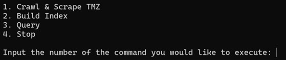
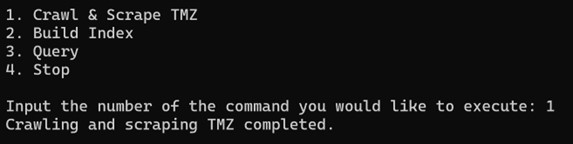
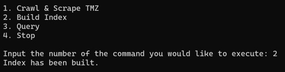
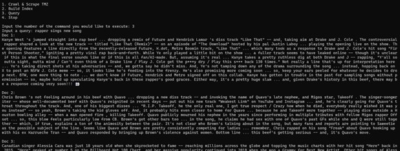
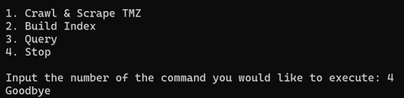

<h1 align="center">Aleksander Popovic</h1>
<h1 align="center">CS 429</h1>
<h1 align="center">Spring 2024</h1>
<h1 align="center">April 22nd, 2024</h1>
<h1 align="center">Individual Project</h1>

## 1. Abstract

The primary objective of this project is to develop a comprehensive search engine system,
encompassing a Scrapy-based web crawler, a Sci-kit-learn-powered indexer, and a Flask-based query
processor. These components are designed to demonstrate and apply the wide range of skills acquired this
semester, which include aspects of web scraping, data indexing, and query processing within a web
application framework. The implementation of the project was successful, fulfilling all the
aforementioned requirements.

Given additional time, the next phase of development would focus on enhancing the efficiency
and breadth of the web crawler through the introduction of concurrent and distributed crawling. This
advancement would significantly reduce the time required for web scraping, thus enabling the acquisition
of a larger corpus of documents for indexing and searching. Furthermore, to increase the user experience
and accessibility of the search engine, the introduction of a graphical user interface (GUI) would be a
priority. This dual-interface approach of having a GUI and a command line interface (CLI) aims to cater
to a wider audience, accommodating both technical users and those who prefer a more intuitive graphical
interaction.

## 2. Overview

### Solution outline

The assignment calls for the creation of three main components: a web crawler, an inverted index
data structure, and a query processor. With that said, my solution covers all these parts.
The web crawler will navigate to various pages of the TMZ news website. Specifically, it will
look at the news, sports, and hip-hop sections; and it will keep navigating to the next page, if one is
available, until it reaches either its page limit or depth limit. Each page contains an article, so the crawler
is then tasked with iterating over each part of the articles and combining them into a single document.
Each document then gets added to a csv file containing all the documents’ texts along with their
corresponding titles.

The inverted index is a python dictionary where the key is every word that has appeared in the
corpus of documents that was just scraped and stored in the csv file. The values are postings list that
contains tuple pairs of numbers. The first number in the tuples is the document ID of each document that
the word was found in. For our purposes, each document’s ID is just the index of its position in the csv
file. The second number in the tuples is the TF-IDF score for each word-document pair. These scores are
necessary to perform the Top-K ranking of the documents later.

The processor, broadly speaking, will consist of a front-end and back-end component. The front
end is a simple application that the user can download and run locally on their machine. The back end
consists of several scripts running on an Ubuntu server that's being hosted on AWS.

### Relevant Literature

Key resources that I referenced throughout the development process include the TMZ news
website and a tutorial by freeCodeCamp.org on how to use and set up Scrapy for web crawling and
scraping. I inspected the TMZ pages to see how their HTML was structured. This allowed me to set rules
for the web scraper, such as which tags to look for in the article and where to look to navigate to the next
page. The Scrapy tutorial showed me how to set up a Scrapy project from scratch and what basic
functions to use to navigate through the different tags on a webpage.

## 3. Design

### System Capabilities

The system is capable of performing three main functions. The first is crawling the various TMZ
pages, scraping the contents of these pages, and storing the resulting documents in a csv file. The second
is creating the inverted index, converting the index into a pickle file, and creating a document-term matrix
from the index. The third is accepting user queries and processing them so that they return the top- 10
matching documents.

Aside from these main capabilities that the user can interact with, there are also internal functions
that the system uses in a few different intermediate steps. The first of these is cleaning the documents and
their titles after they are scraped. When the articles are sent to the csv file, they get stored in a very messy
format, so it is the job of the _doc_cleaner_ program to clean them up from there. The cleaning consists of
stripping away any extra lines or spaces that shouldn't be there and removing any duplicate articles. The
duplicates are the result of the main TMZ homepage containing some articles from other subsections of
the site. When the crawler scrapes the main news page and then subsequently scrapes the hip hop and
sports pages, it may have navigated to some articles that it has already been to.

The system also handles query validation in the form of spelling correction. When a user inputs a
query, the system cleans and normalizes it like it does for any other document in the corpus, but it also
corrects any misspelled words or words that did not appear in the corpus. In terms of error checking, the
system is capable of raising and catching various exceptions. These include a user trying to run a query
before the index is built and trying to build the index before the sites have been scraped, among others. In
both cases, exceptions are thrown by the system and are then caught by the application script so that the
user can receive a helpful error message instead of the error itself.

### Interactions

There are two main interactions in the system, those being the user’s interactions with the
command line interface and the front-end script interacting with the server on AWS. The user interacts
with the application by entering one of the available commands to the command line. With the command
now received from the user, the application then sends an API call to the server requesting the appropriate
function. The server executes the desired function and sends back any necessary data to the application.
Finally, when the application receives the data, it outputs to the shell for the user to see.

### Integration

As mentioned before, the front-end and back-end components exist separately, but are integrated
together through the use of the Ubuntu session on the AWS server. The front-end makes API calls to the
back-end, allowing it to use all of the functionality that is on the server without having it do the
computing locally on the user's machine. This integration applies more to how the user interacts with the
system, however, for the sake of development and version control, the two components are also integrated
on GitHub in this project’s repository.

## 4. Architecture

### Software Components

Front End

The user interaction lies in the front-end, which consists of a single Python script: _application.py_.
This module is the primary interface for user interactions and communication with the server. Exception
handling is another important feature, catching and resolving errors before they reach the user.

Back End

Web Crawler:

- Located within its specific project folder, the web crawler houses all the elements of a basic
    Scrapy project, most of which are initialized upon project creation. The main files to consider are
    as follows:
       o Items File: Defines the _ArticleItem_ class with the fields _title_ and _text_. This provides
          structure for data scraped from the websites.
       o Article Spider Program: Implements a specific spider for crawling the TMZ pages. It
          outlines parsing rules, including allowed domains, start URLs, and navigation strategies
          for site exploration.
- The result of the web crawler's operation is the creation of the _docs.csv_ file. Users are encouraged
    to re-initiate the crawl process for up-to-date information.

Document Cleaner:

- Following data collection, the _doc_cleaner.py_ program cleans each document by stripping it of
    extra spaces and new lines.
- Following the document cleaning step is the document normalization step, which comes in the
    form of the _normalize_text_ function. Cleaning the text, removing emojis, lowercasing, removing
    stop words, and lemmatization are steps in the normalization process.
- Additionally, a spelling correction function helps with query matching by adjusting misspelled
    words based on edit distance calculations against each document in the corpus.

Indexer:

- The indexing step is handled by _indexer.py_ , which is dedicated to transforming cleaned data into
    the TF-IDF inverted index.
- The index is serialized into a pickle file for efficient storage and retrieval. The indexer provides
    mechanisms to both create the pickled index file and restore the original index data structure from
    the pickle file.

Processor:

- The _processor.py_ script processes all the user defined queries. It includes a large set of helper
    functions which are all used to create the _process_query_ function, which manages the comparison
    of user queries against the document-term matrix. Dot product and cosine similarity
    measurements ensure relevant and accurate search results.

Flask Application:

- In addition to the core components, the Flask-based _app.py_ file serves as the integration layer,
    knitting together the functionalities of the document cleaner, indexer, and processor. It interprets
    server requests, directing them to the appropriate module while managing the Flask application's
    routing and API interactions.

### Interfaces

The user interface is a Command Line Interface (CLI) which immediately asks the user for input.
The prompt displays the set of available commands, and after the initial prompt, users can enter
commands directly into the CLI. Each command corresponds to a specific function, such as scraping the
webpages, building the index, querying the corpus, and exiting the application. Users are free to execute
commands in perpetuity until they stop the program.

### Implementation

In the implementation phase, we translate our design concepts into functional code. This section
describes all the software and technical underpinnings employed to implement the project.

Inverted Index:

- We use the inverted index to quickly retrieve relevant documents.
- It is implemented as a Python dictionary, mapping each key term from the document corpus to a
    postings list. The postings list consists of tuples, with each tuple containing two elements: the
    document ID where the term appears and the term's TF-IDF score for that specific document.

Document-Term Matrix:

- We also constructed a document-term matrix to support complex query processing. This matrix is
    represented as a 2D Python list, where each row corresponds to a document in the corpus, and
    each column represents a term from the corpus, arranged in sorted alphabetical order.
- The value at any given position in the matrix signifies the TF-IDF score of the term in that
    document.
- The matrix is used to compute the dot product of user queries against all the document vectors in
    the corpus.

Storage Solutions:

- To ensure the persistence and accessibility of the search engine's core data structures, we
    employed specific storage solutions tailored to the needs of the components:
- The inverted index is serialized and stored in a pickle file. This approach allows for the index to
    be efficiently loaded into memory when the query processor is initiated, ensuring quick access to
    the indexed data for query processing.
- The original documents from which the index is constructed are stored in a csv file. This format
    was chosen for its simplicity and ease of access, allowing the indexer to efficiently process and
    index new documents once they are scraped.

## 5. Operation

Installation

1. Navigate to this project repository at:
    https://github.com/alekpop2/News_Crawler_and_Retriever/tree/main
2. Download the file: _application.py_
3. On your machine, navigate to the directory that _application.py_ is in.
4. Open your command prompt for that directory.

Software Commands

1. Complete the installation steps above.
2. On your command prompt, type the command: _python application.py_

Inputs

1. Complete the software command steps above.
2. The program should produce an output like the following in your command prompt:

3. From there, enter the number associated with one of the available commands (1-4). It is
    recommended that the user run commands (1-3) in order the first time they run the program to get
    the most up-to-date documents and index.

## 6. Conclusion

### Results

In assessing the outcomes of the project, it is essential to recognize that the primary aim was not
to advance research or uncover novel findings. Instead, the project sought to demonstrate proficiency in
executing key components: web crawling, indexing, and query processing, all while integrating these
elements into a system hosted via a Flask application. By these measures, the project has achieved notable
success, fulfilling its objectives and demonstrating the practical application of these technologies.
Additionally, the project's attention to detail in handling the finer aspects of each component—such as
spelling correction and exception handling—further highlights its success.

### Outputs

Here, we detail the responses and feedback provided by our system through its Command Line
Interface (CLI) upon execution of various commands. The outputs associated with the four main
commands available to the user—scrape website, build index, query, and exit—are below.

- Upon selecting the scrape website command, the system initiates the web crawling process. The
    output is either a success message or an exception message.
- The build index command triggers the process of creating an inverted index from the scraped
    website data. The output is either a success message or a message saying that the webpages have
    not been scraped yet.
- The query command is central to the search engine's functionality, allowing users to input text
    queries and receive the top- 10 matching documents in return. The output is either the top- 10
    documents or a message saying that the inverted index has not been created yet.
- Finally, the exit command provides the simple function of terminating the command loop and
    concluding the user's session with the search engine. The output for this command is a
    "Goodbye," signaling the end of the session.

### Caveats/Cautions

While using the project, users should be aware of two primary caveats that could impact their
experience and the relevance of search results. Understanding these limitations is crucial for optimizing
the use of the search engine.

The first caveat involves the potential use of an outdated _docs.csv_ file. If users initiate query
operations without first executing the scrape command, there is a significant likelihood that the search
will return documents that are not reflective of the most current information available. This scenario
primarily arises if the scrape and index commands are not run at the beginning of each session. To
mitigate this issue, users are strongly advised to always perform a fresh scrape and indexing at the start of
their interaction with the program. While this requirement may seem like a limitation, it also presents an
exciting feature of the project. Given that the TMZ news site is updated daily, executing the web crawler
regularly ensures access to the latest articles. This means that with each crawl, especially when conducted
at longer intervals, users can access and index a fresh batch of content, keeping outputs dynamic and
current.

The second caveat relates to the thematic scope of the search queries. The search engine's
document corpus is sourced from TMZ, a news outlet predominantly focused on celebrity gossip, sports,
and hip-hop music. Consequently, queries related to these topics are likely to yield relevant results.
However, users should limit their expectations for queries outside of these areas, such as those concerning
general news, politics, or technical subjects. This limitation is not indicative of a flaw within the project's
design or implementation but rather a reflection of the chosen document source's thematic focus.
Nevertheless, as long as the search engine is returning the top 10 documents for a given query, users can
be assured that it is working properly. This consideration underscores the importance of aligning query
topics with the content themes of the indexed documents to maximize the relevance and utility of search
results.

## 7. Data Sources

TMZ Pages:

- News: https://www.tmz.com/
- Sports: https://www.tmz.com/sports/
- Hip-Hop: https://www.tmz.com/hip-hop/

## 8. Test Cases

### Framework : N/A
### Harness : N/A

### Coverage

Below is a list of the available commands and what a successful execution of each one should look like.

1. Crawl & Scrape TMZ

2. Build Index

3. Query

4. Stop

## 9. Source Code

### Listings

https://github.com/alekpop2/News_Crawler_and_Retriever/tree/main

### Dependencies

Python Libraries:

Bisect, Flask, Math, NLTK, NumPy, OS, Pandas, Pickle, RE, Sci-Kit-Learn, Scrapy, Subprocess

### Documentation

Bisect: https://docs.python.org/3/library/bisect.html
Flask: https://flask.palletsprojects.com/en/3.0.x/
Math: https://docs.python.org/3/library/math.html
NLTK: https://www.nltk.org/
NumPy: https://numpy.org/doc/
OS: https://docs.python.org/3/library/os.html
Pandas: https://pandas.pydata.org/docs/
Pickle: https://docs.python.org/3/library/pickle.html
RE: https://docs.python.org/3/library/re.html
Sci-Kit-Learn: https://scikit-learn.org/stable/
Scrapy: https://docs.scrapy.org/en/latest/
Subprocess: https://docs.python.org/3/library/subprocess.html

## 10. Bibliography

Manning, Christopher D., Prabhakar Raghavan, and Hinrich Schütze. Introduction to Information
Retrieval. Cambridge: Cambridge University Press, 2008.

OpenAI. "ChatGPT." Accessed April 22, 2024. https://www.openai.com/chatgpt.

freeCodeCamp.org. "Scrapy Course – Python Web Scraping for Beginners." YouTube video, 4:37:08.
Published April 27, 2023. https://www.youtube.com/watch?v=mBoX_JCKZTE.

